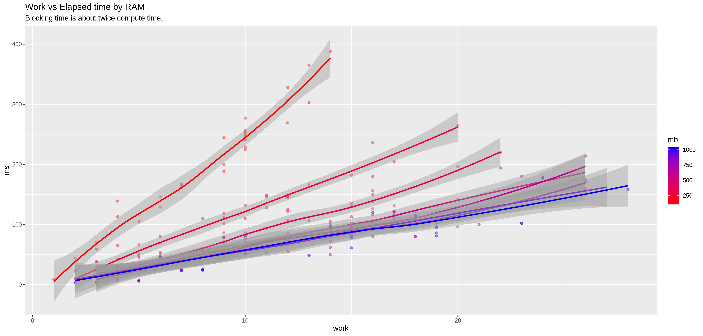
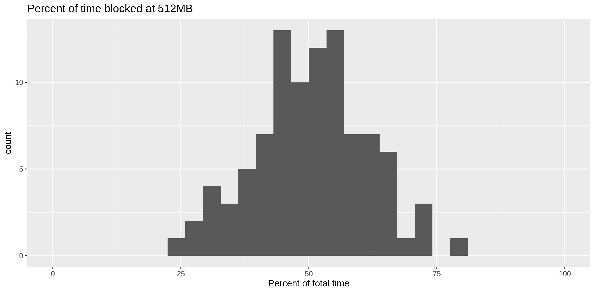
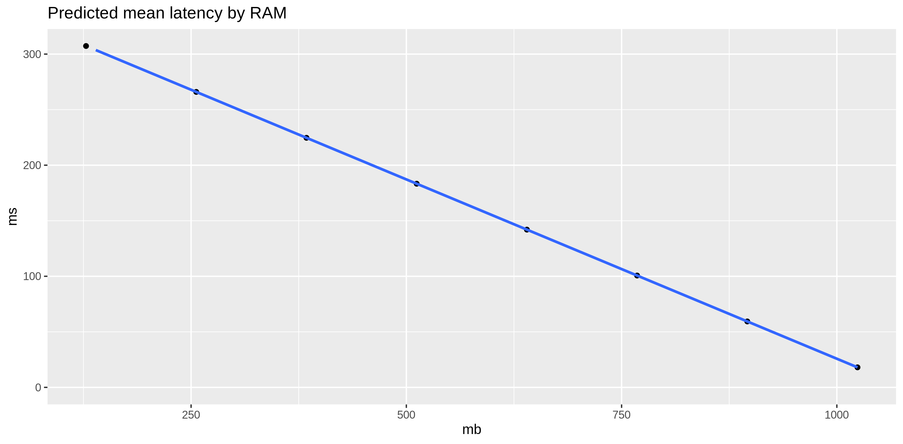

# Experiment: Lambda computing performance vs RAM

Execute a Lambda, with specified compute/blocking mixes, with varying
Lambda RAM settings.

## Usage

Head to [`lambda`](lambda) and look at [`Makefile`](lambda/Makefile)
to get the test Lambda going.

Consider the compute/blocking operations distributions as specified in
[`spec.json`](spec.json).  Use a [gamma
distribution](https://en.wikipedia.org/wiki/Gamma_distribution) to
specify how long (in milliseconds) a simulated blocking operation
takes.  Use [Poisson
distributions](https://en.wikipedia.org/wiki/Poisson_distribution) to
specify how many non-blocking operations each execution has and how
many work units each of those operations performs.  A work unit is
specified by `StepKeys`, which is the number of generates keys in a
map, and `StepRounds`, which is the number of map
serialization/deserialization round trips performed in a work unit.

At 512MB, the example spec probably has about equal amounts of
computing and blocking.

After editing `spec.json`, [run](run.sh) a test that executes the
Lambda multiple times for various RAM settings.


```Shell
(cd call-lambda && make && ./run.sh)
```

Examine the output (`d.csv`):

```R
library(tidyverse)
d <- read_csv("call-lambda/d.csv")
summary(d)

d %>% group_by(mb) %>% 
	summarize(mean_work_time=mean(work_time), mean_block_time=mean(block_time))

ggplot(d, aes(worked,ms,color=mb,group=mb)) + 
	geom_point(alpha=0.4) + 
	geom_smooth(method=lm) + 
	scale_colour_gradient(low="red",high="blue") +
	labs(title="Work vs Elapsed time by RAM",
	     subtitle="Blocking time is about the same as compute time at 512MB.")
ggsave("eff-by-ram.png")


d %>% filter(mb==512) %>% 
	mutate(percent_blocked=100*block_time/ms) %>% 
	ggplot(aes(percent_blocked)) + 
	geom_histogram(bin_width=5) + 
	labs(title="Percent of time in blocking ops at 512MB",x="Percent of total time") + 
	xlim(0,100)
ggsave("blocking.png")

# Efficiency
d$e <- d$ms/d$worked

m <- lm(e ~ mb, data=d)
d1 <- data.frame(mb=seq(128,1024,128))
predict(m, d1)
d1$e <- predict(m, d1)

# For average work, what's the expected latency?
d1$ms <- mean(d$worked) * d1$e

ggplot(d1, aes(mb, ms)) + 
	geom_point() + 
	geom_smooth() + 
	ylim(0, max(d1$ms)) + 
	labs(title="Predicted mean latency by RAM")
ggsave("predict.png")
```





The predicted mean latencies (milliseconds) by RAM tier:

```
    mb         e        ms
1  128 7.7184122 309.36361
2  256 6.6762669 267.59312
3  384 5.6341215 225.82263
4  512 4.5919762 184.05215
5  640 3.5498309 142.28166
6  768 2.5076855 100.51117
7  896 1.4655402  58.74068
8 1024 0.4233949  16.97020
```

For the example job, a 128GB Lambda is about 20 times slower that a
1GB Lambda.  For comparison, for jobs that do half as much computation
but the same about of blocking, a 128GB Lambda is about three times
slower than a 1GB Lambda.

```
    mb        e        ms
1  128 7.381373 153.71710
2  256 6.646208 138.40728
3  384 5.911043 123.09747
4  512 5.175878 107.78766
5  640 4.440713  92.47785
6  768 3.705548  77.16804
7  896 2.970383  61.85823
8 1024 2.235218  46.54842
```

Of course, the level of expected latency, in the context of a specific
application, is an important consideration.


