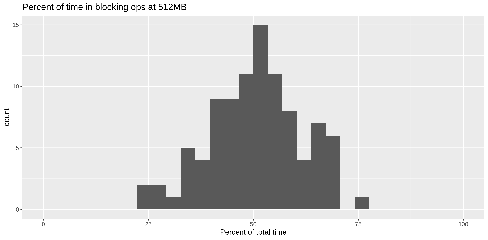

# Experiment: Lambda computing vs RAM

Execute a Lambda, with specified compute/blocking mixes, with varying
RAM.

## Usage

Head to [`lambda`](lambda) and look at [`Makefile`](lambda/Makefile)
to get the test Lambda going.

Consider the compute/blocking mix distributions as specified in
[`spec.json`](spec.json).  That spec probably has about twice as much
blocking time as CPU-constrained work.

The run some tests:

```Shell
(cd call-lambda && make && ./run.sh)
```

Examine the output (`d.csv`):

```R
library(tidyverse)
d <- read_csv("call-lambda/d.csv")
summary(d)

d %>% group_by(mb) %>% 
	summarize(mean_work_time=mean(work_time), mean_block_time=mean(block_time))

ggplot(d, aes(worked,ms,color=mb,group=mb)) + 
	geom_point(alpha=0.4) + 
	geom_smooth(method=lm) + 
	scale_colour_gradient(low="red",high="blue") +
	labs(title="Work vs Elapsed time by RAM",
	     subtitle="Blocking time is the same as compute time at 512MB.")
ggsave("eff-by-ram.png")


d %>% filter(mb==512) %>% 
	mutate(percent_blocked=100*block_time/ms) %>% 
	ggplot(aes(percent_blocked)) + 
	geom_histogram(bin_width=5) + 
	labs(title="Percent of time blocked at 512MB",x="Percent of total time") + 
	xlim(0,100)
ggsave("blocking.png")

# Efficiency
d$e <- d$ms/d$worked

m <- lm(e ~ mb, data=d)
d1 <- data.frame(mb=seq(128,1024,128))
predict(m, d1)
d1$e <- predict(m, d1)

# For average work, what's the expected latency?
d1$ms <- mean(d$worked) * d1$e

ggplot(d1, aes(mb, ms)) + 
	geom_point() + 
	geom_smooth() + 
	ylim(0, max(d1$ms)) + 
	labs(title="Predicted mean latency by RAM")
ggsave("predict.png")
```




The predicted mean latencies (milliseconds) by RAM tier:

```
    mb         e        ms
1  128 7.7184122 309.36361
2  256 6.6762669 267.59312
3  384 5.6341215 225.82263
4  512 4.5919762 184.05215
5  640 3.5498309 142.28166
6  768 2.5076855 100.51117
7  896 1.4655402  58.74068
8 1024 0.4233949  16.97020
```


