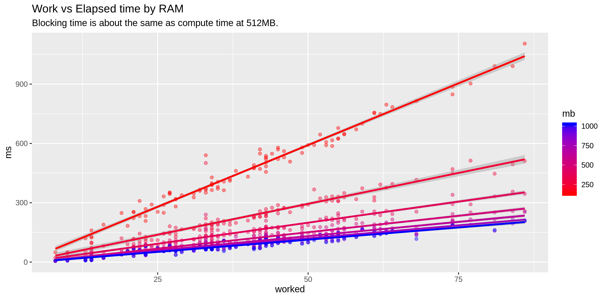

# Experiment: Lambda CPU vs RAM

Execute a Lambda, with specified compute/blocking mixes, with varying
RAM.

## Usage

Head to [`lambda`](lambda) and look at [`Makefile`](lambda/Makefile)
to get the test Lambda going.

Consider the compute/blocking mix distributions as specified in
[`spec.json`](spec.json).

The run some tests:

```Shell
(cd call-lambda && ./run.sh)
```

Examine the output (`d.csv`):

```R
library(tidyverse)
d <- read_csv("call-lambda/d.csv")
ggplot(d, aes(work,ms,color=mb,group=mb)) + 
	geom_point(alpha=0.4) + 
	geom_smooth() + 
	scale_colour_gradient(low="red",high="blue") +
	labs(title="Work vs Elapsed time by RAM",
	     subtitle="Blocking time is about twice compute time.")

# Efficiency
d$e <- d$ms/d$work

m <- lm(e ~ mb, data=d)
d1 <- data.frame(mb=seq(128,1024,128))
predict(m, d1)
d1$e <- predict(m, d1)

# For average work, what's the expected latency?
d1$ms <- mean(d$work) * d1$e
```



The predicted mean latencies by RAM tier:

```
    mb         e        ms
1  128 15.748914 181.44062
2  256 13.819109 159.20765
3  384 11.889303 136.97468
4  512  9.959498 114.74171
5  640  8.029692  92.50874
6  768  6.099886  70.27578
7  896  4.170081  48.04281
8 1024  2.240275  25.80984
```

```R
ggplot(d1, aes(mb, ms)) + 
	geom_point() + 
	geom_smooth() + 
	ylim(0, max(d1$ms)) + 
	labs(title="Predicted mean latency by RAM")
```


